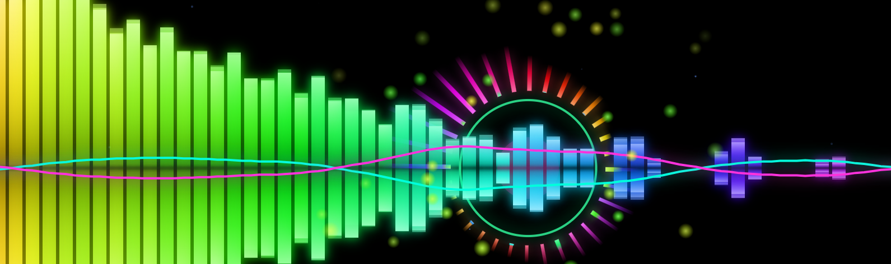
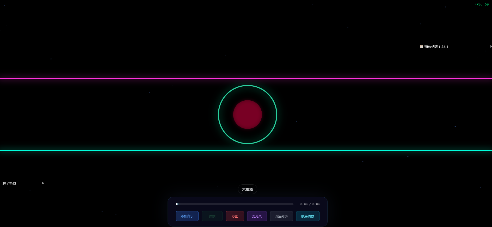
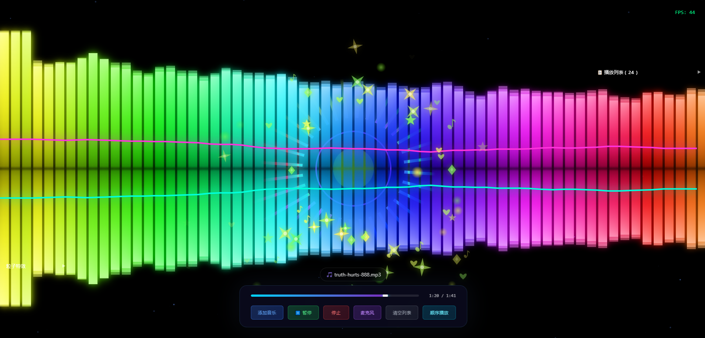
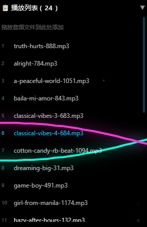
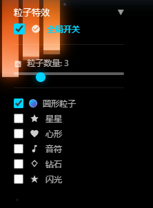

# 音频可视化频谱特效

一个基于 Web Audio API 和 Canvas 的高性能音频可视化应用，支持频谱分析、粒子特效和播放列表管理。



## ✨ 功能特性

### 🎵 音频播放
- **本地文件播放** - 支持拖放或选择本地音频文件
- **麦克风输入** - 实时可视化麦克风音频
- **播放列表管理** - 支持多首歌曲，自动记忆播放列表
- **IndexedDB 存储** - 音频文件持久化存储，刷新不丢失

### 🎨 可视化效果
- **频谱柱状图** - 动态频谱分析，支持镜像效果
- **圆形频谱** - 旋转圆形频谱，脉冲动画
- **波形图** - 实时波形显示
- **粒子特效** - 跟随音乐节拍的粒子爆发效果
  - 圆形粒子
  - 星星
  - 心形
  - 音符
  - 钻石
  - 闪光

### 🎛️ 播放控制
- **三种播放模式**
  - 顺序播放
  - 列表循环
  - 随机播放
- **自动下一首** - 歌曲播放完毕自动切换
- **进度控制** - 支持拖拽进度条
- **暂停/恢复** - 精确控制播放状态

### ⚡ 性能优化
- **自适应降级** - 根据 FPS 自动调整频谱分辨率 (128 → 64)
- **粒子池** - 预分配粒子对象，避免 GC
- **离屏渲染** - Canvas 缓存优化
- **内存管理** - Uint8Array 预分配，零数组膨胀

## 🚀 快速开始

### 在线体验
直接在浏览器中打开 `音乐频谱.html` 文件即可使用。

```bash
# 或使用本地服务器
python -m http.server 8080
# 然后访问 http://localhost:8080/音乐频谱.html
```

### 使用说明

1. **添加音乐**
   - 点击"添加音乐"按钮选择文件
   - 或直接将音频文件拖放到播放列表区域

2. **播放控制**
   - 播放/暂停：控制当前歌曲
   - 停止：停止播放并重置
   - 麦克风：切换到麦克风输入模式

3. **播放模式**
   - 点击"顺序播放"按钮切换模式
   - 支持顺序、循环、随机三种模式

4. **粒子特效**
   - 点击"粒子特效"面板展开设置
   - 勾选想要的粒子类型
   - 调整粒子数量滑块

5. **清空列表**
   - 点击"清空列表"按钮删除所有歌曲

## 📸 截图展示

### 主界面


### 频谱可视化


### 播放列表


### 粒子特效设置



## 📝 浏览器兼容性

- Chrome 80+
- Firefox 75+
- Safari 14+
- Edge 80+

> 注意：需要使用支持 Web Audio API 和 IndexedDB 的现代浏览器

## 🤝 贡献

欢迎提交 Issue 和 Pull Request！


---

Made with ❤️ and 🎵
